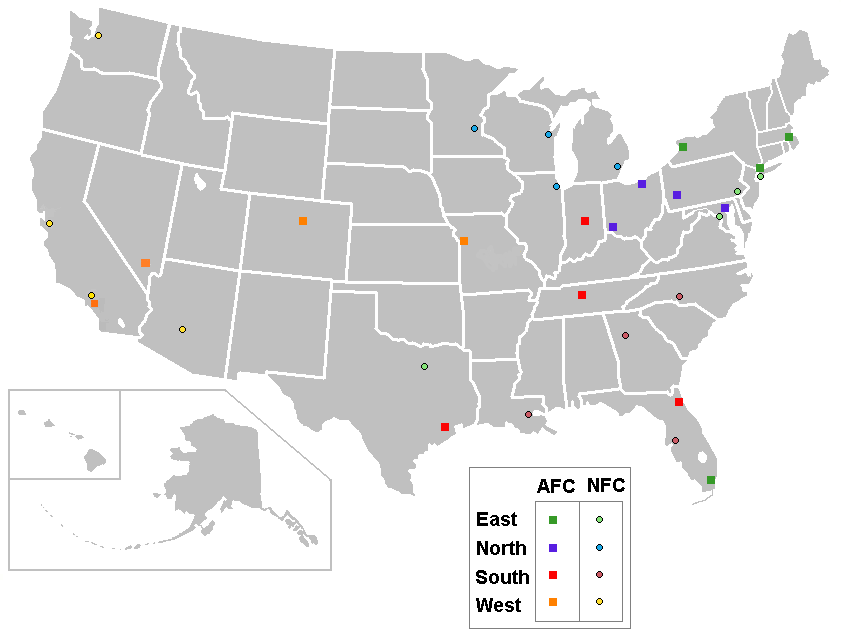

# ETL_Project

In our ETL_Project, we intent to use the NFL game and score information from Kaggle (see link below) to create a database with key Superbowl statistics – including games, stadium, winning/losing teams, mvp player, key highlights, etc.  We will use Pandas to extract and clean up the data, load the data into SQL databases, and use SQL to extract information from different datasets or tables.  

# Data Extract:
- https://www.topendsports.com/events/super-bowl/winners-list.htm
  - The list of all the teams played in Super Bowl since Green Bay won the first in 1967. The years listed indicate the year the Super Bowl was played, the regular season is 
    played during the year before.
  
- https://en.wikipedia.org/wiki/List_of_Super_Bowl_starting_quarterbacks
  - This is a list of NFL quarterbacks with Super Bowl starts.
  
- http://www.espn.com/nfl/superbowl/history/mvps
  - The list of all most valuable players in NFL history with their position and the highlights.
  
- http://stats.washingtonpost.com/fb/glossary.asp
  - This website was mainly scraped to add abbreviation expansion to the MVP list. Containts the abbreviation and and expansion of abbreviation for Player Position. 
  
- https://www.kaggle.com/tobycrabtree/nfl-scores-and-betting-data
  - scores.csv - NFL football games since the 1966 season with game results and descriptive info including if a playoff game, played at a neutral site, and weather information 
    if available. Data set was built from publicly available NFL data, weather provided by the NOAA, and betting data from a variety of sources but cross referenced with Pro 
    Football Reference.
  - teams.csv - NFL teams, team IDs, and conferences
  - stadiums.csv
  
  
# Data Transformation:
- Cleaning up data: Removing special character using regular expressions 
- Dropped columns that are not needed and renamed the columns for consistency
- Stripping data into multiple columns based on coditions
# Data Load:
- Loaded the data from pandas dataframes to Postgres Database.
- Created tables by joining the tables and converted them to pandas dataframe
